# Week 5 作業

## Task 2

### - 建立website database
```sql
mysql> CREATE DATABASE website;  
```


### - 建立member表格
```sql
use website  
create table member(
id int unsigned auto_increment primary key,  
name varchar(254) not null,  
email varchar(254) not null,  
password varchar(254) not null,  
follower_count int unsigned not null default 0,  
time datetime not null default current_timestamp  
);  
```
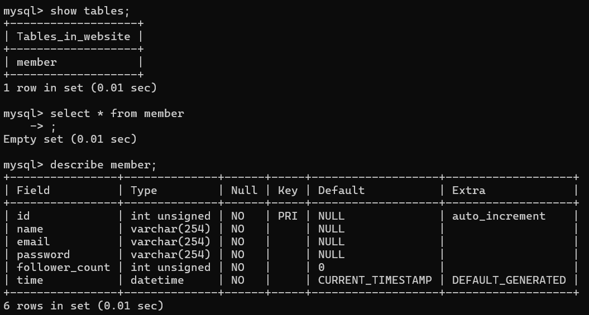


## Task 3
###   INSERT a new row to the member table where name, email and password must be set to  test ,  test@test.com , and  test . INSERT additional  4 rows with arbitrary data.
```sql
insert into member(name, email, password, follower_count, time)  
values  
('test', 'test@test.com', 'test',10, '2025-11-13 22:35:19'),  
('allen', 'allen@test.com', 'allentest',100, '2025-11-14 22:35:19'),  
('jack', 'jack@test.com', 'jacktest', 9999, '2025-11-17 22:35:19'),  
('edison', 'edison@test.com', 'edisontest',345, '2025-11-16 22:35:19'),  
('morgan', 'morgan@test.com', 'morgantest',213, '2025-11-15 22:35:19');
```  
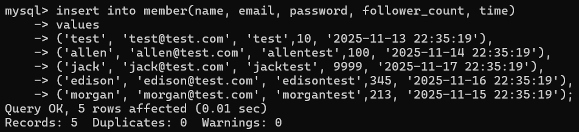


###  - SELECT all rows from the member table.
```sql
select * from member 
``` 
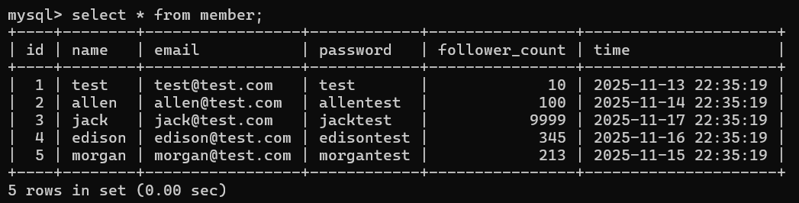


###  - SELECT all rows from the member table, in descending order of time.
```sql
select * from member  
order by time desc; 
``` 
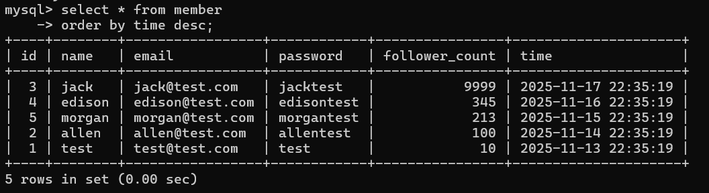

###  - SELECT total 3 rows, second to fourth, from the member table, in descending order 
of time.
```sql
select * from member
order by time desc
limit 1, 3;
```
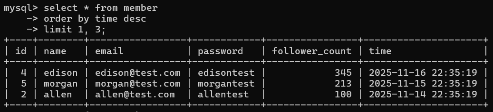

### -  SELECT rows where email equals to test@test.com .
```sql
select * from member
where email = 'test@test.com';
```
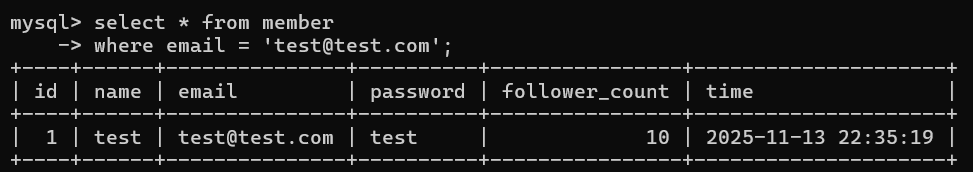

### -  SELECT rows where name includes the es keyword.
```sql
select * from member
where name like '%es%';
```
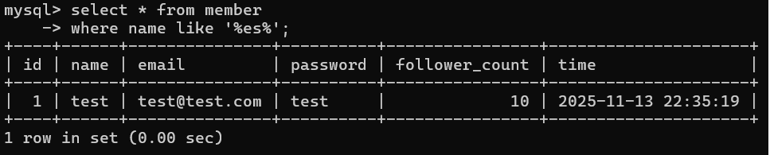

### -   SELECT rows where email equals to test@test.com and password equals to test .
```sql
select * from member
where email = 'test@test.com' and password = 'test';
```
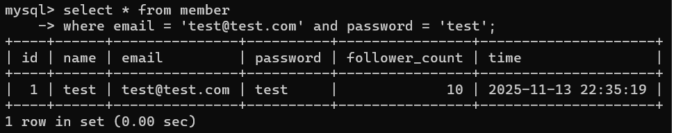

### -  UPDATE data in name column to  test2  where email equals  to  test@test.com . 
```sql
update member
set name = 'test2'
where email = 'test@test.com';
```
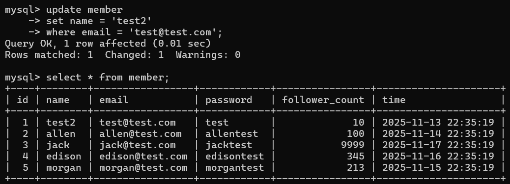

## Task4
### -  SELECT how many rows from the member table.
```sql
select count(id) from member;
```
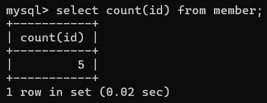

### -  SELECT the sum of follower_count of all the rows from the member table.
```sql
select sum(follower_count) from member;
```
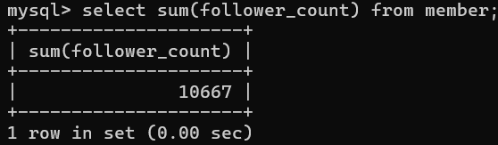

### -  SELECT the average of follower_count of all the rows from the member table.
```sql
select avg(follower_count) from member;
```
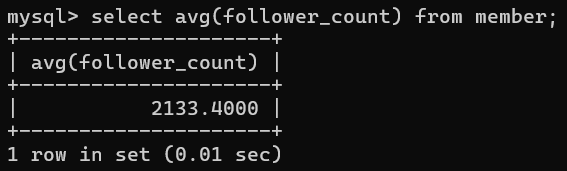


### -  SELECT the average of follower_count of the first 2 rows, in descending order of 
follower_count, from the member table.

```sql
select avg(follower_count) as avg_top2
from (
    select follower_count from member
    order by follower_count desc
    limit 2
) as top2;

```
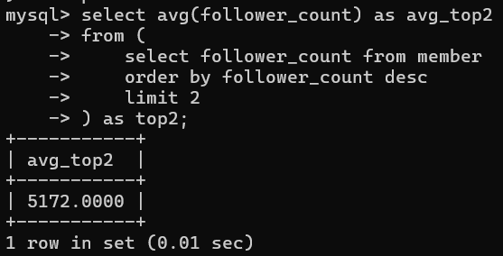

## Task 5
###  - Create a new table named  message  , in the  website  database.
```sql
Create table message(
    id int unsigned auto_increment primary key,
    member_id int unsigned not null,
    content text(65534) not null,
    like_count int unsigned not null default 0,
    time datetime not null default current_timestamp,
    foreign key(member_id) references member(id)
);
```
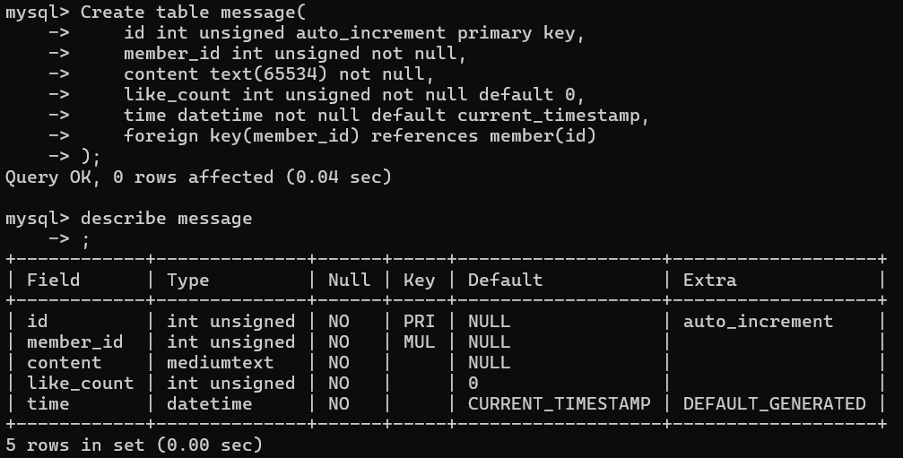

### -  SELECT all messages, including sender names. We have to JOIN the member table to get that.
```sql
select message.content, member.name  from message inner join member on message.member_id = member.id; 
```
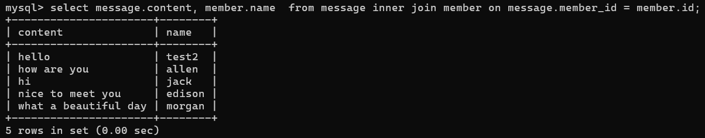

### -  SELECT all messages, including sender names, where sender email equals to 
test@test.com.
```sql
select message.content, member.name from message inner join member on message.member_id = member.id where member.email = 'test@test.com';
```
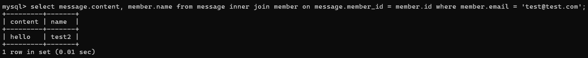

### -  Use SELECT, SQL Aggregation Functions with JOIN statement, get the average like count of messages where sender email equals to  test@test.com .
```sql
select member.email, avg(message.like_count) from message inner join member on message.member_id = member.id where member.email = 'test@test.com';
```


### -  Use SELECT, SQL Aggregation Functions with JOIN statement, get the average like count of messages GROUP BY sender email.
```sql
select member.email, avg(message.like_count) from message inner join member on message.member_id = member.id group by member.email;
```
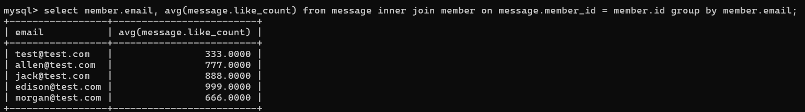